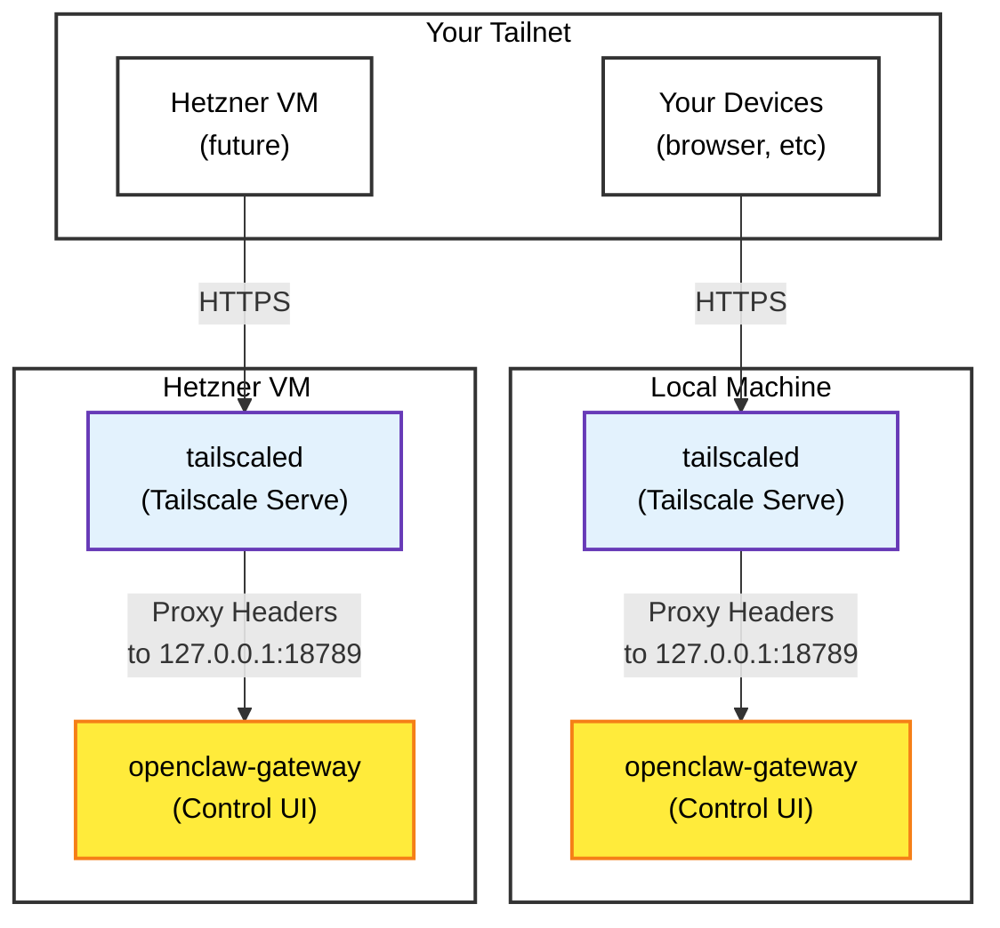

# OpenClaw Docker + Tailscale Setup

## Architecture Overview

This setup runs OpenClaw in Docker with a Tailscale sidecar for secure, encrypted access from anywhere.



### Components

**openclaw-gateway**
- Main OpenClaw service running on `127.0.0.1:18789`
- Binds to loopback only (not exposed to public internet)
- Provides Control UI and WebSocket endpoint

**tailscaled** (sidecar)
- Runs Tailscale daemon in userspace mode
- Connected to your tailnet via auth key
- Provides HTTPS via `tailscale serve --bg`
- Proxies HTTPS traffic to gateway's loopback address

**Key Features**
- ✅ **End-to-end encryption**: All traffic over Tailscale
- ✅ **No port forwarding**: Use tailnet URLs only
- ✅ **Token authentication**: Simple secure auth
- ✅ **Easy deployment**: One compose file, environment variables

## Local Development Setup

### Prerequisites
- Docker & Docker Compose installed
- Tailscale CLI installed locally
- Fork of `openclaw/openclaw` (your fork: https://github.com/YOUR-USERNAME/openclaw)

### Files Structure

```
~/openclaw/                          # or your repo path
 ├── Dockerfile                          # Gateway container definition
 ├── docker-compose.tailscale.yml         # Tailscale + gateway services
 ├── .env                               # Configuration (DO NOT COMMIT)
 ├── .gitignore                          # Excludes tailscale-state/
 ├── dist/                              # Built JavaScript (if local image)
 └── tailscale-state/                    # Tailscale state (DO NOT COMMIT)
```

### Configuration (.env)

```bash
# Gateway Settings
OPENCLAW_CONFIG_DIR=~/.openclaw
OPENCLAW_WORKSPACE_DIR=~/.openclaw/workspace
OPENCLAW_GATEWAY_PORT=18789
OPENCLAW_BRIDGE_PORT=18790
OPENCLAW_GATEWAY_BIND=loopback
OPENCLAW_GATEWAY_TOKEN=<your-gateway-token>
OPENCLAW_IMAGE=openclaw:local

# Tailscale Settings
TAILSCALE_AUTH_KEY=tskey-auth-<reusable-key>
TAILSCALE_HOSTNAME=openclaw-local
TAILSCALE_STATE_DIR=./tailscale-state
TAILSCALE_EXTRA_ARGS=--advertise-exit-node
```

### Starting Services

```bash
cd ~/openclaw  # or your repo path

# Build image (if using local source)
docker build -t openclaw:local .

# Start with Tailscale sidecar
docker compose -f docker-compose.tailscale.yml up -d

# Check logs
docker logs openclaw-openclaw-gateway-1 -f
docker logs tailscaled -f
```

### Accessing the Gateway

**From local machine:**
```
http://localhost:18789/
```

**From any device on tailnet:**
```
https://openclaw-local.tailde3230.ts.net/
```

**From local machine via Tailscale (same result):**
```
https://openclaw-local.tailde3230.ts.net/
```

**Authentication:**
1. Open Control UI URL
2. Click Settings (gear icon)
3. Paste gateway token from `.env`
4. Click Save
5. Refresh page

### Stopping Services

```bash
docker compose -f docker-compose.tailscale.yml down

# Clean up Tailscale state (optional)
rm -rf tailscale-state/
```

## Hetzner Deployment

### Prerequisites on Hetzner VM

```bash
# Update system
sudo apt update && sudo apt upgrade -y

# Install Docker
curl -fsSL https://get.docker.com -o get-docker.sh
sudo sh get-docker.sh
sudo usermod -aG docker $USER

# Install Docker Compose
sudo apt install docker-compose-plugin -y

# Logout and login for group changes to take effect
```

### Clone Your Fork

```bash
# Clone your fork (NOT upstream!)
git clone https://github.com/YOUR-USERNAME/openclaw.git
cd openclaw
```

### Create Production .env

```bash
cat > .env << 'EOF'
OPENCLAW_CONFIG_DIR=/root/.openclaw
OPENCLAW_WORKSPACE_DIR=/root/.openclaw/workspace
OPENCLAW_GATEWAY_PORT=18789
OPENCLAW_BRIDGE_PORT=18790
OPENCLAW_GATEWAY_BIND=loopback
OPENCLAW_GATEWAY_TOKEN=<generate-new-token>
OPENCLAW_IMAGE=openclaw:local

# Tailscale Settings (USE EPHEMERAL KEY FOR PROD!)
TAILSCALE_AUTH_KEY=tskey-auth-<ephemeral-key>
TAILSCALE_HOSTNAME=openclaw-prod
TAILSCALE_STATE_DIR=./tailscale-state
TAILSCALE_EXTRA_ARGS=
EOF
```

**Important:**
- Use **ephemeral Tailscale auth key** for production
- Generate **new gateway token** for production
- Don't reuse dev tokens!

### Build and Deploy

```bash
# Build OpenClaw image
docker build -t openclaw:local .

# Start services
docker compose -f docker-compose.tailscale.yml up -d

# Verify running
docker ps
docker logs openclaw-openclaw-gateway-1 -f
docker logs tailscaled -f
```

### Configure Tailscale Serve

```bash
# Check Tailscale is connected
docker exec tailscaled tailscale status

# Configure HTTPS serve (port 443)
docker exec tailscaled tailscale serve --bg https / https://127.0.0.1:18789
```

### Access Production Gateway

```
https://openclaw-prod.tailde3230.ts.net/
```

Use production gateway token for authentication.

### Firewall Considerations

Hetzner may have firewall enabled. Allow:

```bash
# Allow inbound HTTPS (443) for Tailscale Serve
# (If using Funnel for public access)
```

Tailscale uses NAT traversal, so inbound UDP/TCP not required for standard tailnet access.

## Git Workflow

### Repository Structure

```
origin (upstream)   https://github.com/openclaw/openclaw.git
fork (your fork)     https://github.com/YOUR-USERNAME/openclaw.git
local (your machine)   working directory
```

### Initial Setup (Already Done ✅)

```bash
# 1. Fork upstream repo on GitHub
# 2. Add fork as remote
git remote add fork https://github.com/YOUR-USERNAME/openclaw.git

# 3. Commit changes to fork
git add .
git commit -m "Add Tailscale sidecar configuration"
git push fork main
```

### Pulling Upstream Updates

```bash
# Get upstream changes
git fetch upstream

# Merge into your fork (handles conflicts)
git merge upstream/main --no-edit

# Push updated fork
git push fork main
```

### Making Changes

```bash
# Make changes locally
vim docker-compose.tailscale.yml

# Commit to your fork
git add docker-compose.tailscale.yml
git commit -m "Update Tailscale config"
git push fork main
```

### Deploying Updates to Hetzner

```bash
# On Hetzner server
git fetch fork
git pull fork main

# Rebuild if needed
docker build -t openclaw:local .
docker compose -f docker-compose.tailscale.yml up -d --force-recreate
```

## Troubleshooting

### Gateway Not Accessible via Tailscale

**Check Tailscale is running:**
```bash
docker logs tailscaled | grep "Startup complete"
```

**Check Serve configuration:**
```bash
docker exec tailscaled tailscale serve status
```

**Check gateway is listening:**
```bash
docker logs openclaw-openclaw-gateway-1 | grep "listening on"
```

**Check host is on tailnet:**
```bash
tailscale status  # Run from host machine
```

### "Proxy headers detected from untrusted address"

This is expected with Tailscale Serve. Ensure your gateway config has:

```json
{
  "gateway": {
    "bind": "loopback",
    "auth": {
      "mode": "token"
    }
  }
}
```

Using token auth over HTTPS is simpler than Tailscale identity auth.

### Container Won't Start

**Check port conflicts:**
```bash
sudo ss -ltnp | grep 18789
```

**Check Tunnels:**
```bash
ps aux | grep tailscaled
```

**Recreate from scratch:**
```bash
docker compose -f docker-compose.tailscale.yml down
rm -rf tailscale-state/
docker compose -f docker-compose.tailscale.yml up -d
```

### Tailscale Auth Key Issues

**Generate new key:**
1. Go to https://tailscale.com/admin/settings/keys
2. Create ephemeral key (for production)
3. Update `.env` and restart:
```bash
docker compose -f docker-compose.tailscale.yml restart tailscaled
```

### Gateway Logs

```bash
# Live logs
docker logs openclaw-openclaw-gateway-1 -f

# Last 50 lines
docker logs openclaw-openclaw-gateway-1 --tail 50

# Follow all services
docker compose -f docker-compose.tailscale.yml logs -f
```

## Security Notes

### What's Secure

✅ **HTTPS encryption**: Tailscale Serve provides TLS
✅ **Token auth**: Gateway requires authentication
✅ **No public exposure**: Gateway bound to loopback
✅ **Tailnet-only**: Only devices on your tailnet can access

### What's NOT Secure

⚠️ **Reusable auth keys**: Use ephemeral keys for production
⚠️ **Committed tokens**: `.env` in `.gitignore` (already done)
⚠️ **Local HTTP**: Only for trusted networks

### Best Practices

- Use **ephemeral Tailscale auth keys** for production
- Rotate **gateway tokens** regularly
- Never commit `.env` file
- Use **VPN/SSH** for Hetzner server access
- Enable **Tailscale audit logs** in admin panel

## Quick Reference

### Start Local Development

```bash
cd ~/openclaw  # or your repo path
docker compose -f docker-compose.tailscale.yml up -d
```

### Access URLs

- Local: `http://localhost:18789/`
- Tailnet: `https://openclaw-local.tailde3230.ts.net/`
- Production: `https://openclaw-prod.tailde3230.ts.net/`

### Git Commands

- Pull upstream: `git fetch upstream && git merge upstream/main`
- Push to fork: `git push fork main`
- Deploy to Hetzner: `git pull fork main && docker compose -f docker-compose.tailscale.yml up -d`

### Docker Commands

- Logs: `docker logs openclaw-openclaw-gateway-1 -f`
- Stop: `docker compose -f docker-compose.tailscale.yml down`
- Restart: `docker compose -f docker-compose.tailscale.yml restart`
- Rebuild: `docker build -t openclaw:local .`

## Environment Variables Reference

| Variable | Description | Example Local | Example Production |
|-----------|-------------|----------------|------------------|
| `OPENCLAW_CONFIG_DIR` | Config directory | `~/.openclaw` | `/root/.openclaw` |
| `OPENCLAW_GATEWAY_TOKEN` | Gateway auth token | Reusable | Generate new |
| `OPENCLAW_GATEWAY_BIND` | Network bind | `loopback` | `loopback` |
| `TAILSCALE_AUTH_KEY` | Tailscale auth | Reusable | **Ephemeral** |
| `TAILSCALE_HOSTNAME` | Tailnet hostname | `openclaw-local` | `openclaw-prod` |

## Support

- **Upstream repo**: https://github.com/openclaw/openclaw
- **Your fork**: https://github.com/YOUR-USERNAME/openclaw
- **Tailscale docs**: https://tailscale.com/kb/1242/tailscale-serve
- **OpenClaw docs**: https://docs.openclaw.ai/

---

**Last Updated:** 2026-02-08
**Author:** james (jimiryquai)
